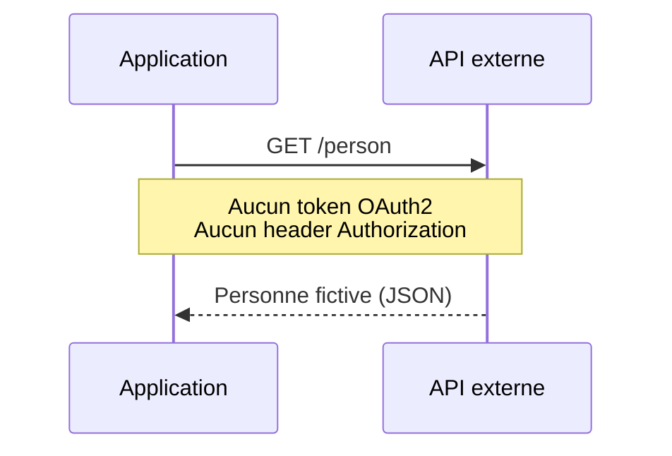
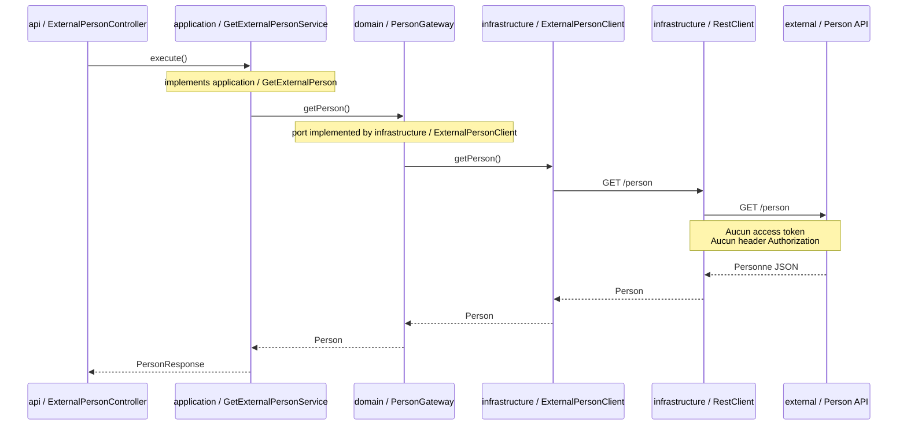

# API sans OAuth2

Module Spring Boot 4.0.4 reprenant la même API maquette en quatre couches que les modules
OAuth2, mais sans aucune sécurisation OAuth2 côté client.

## Fonctionnement

L'endpoint `GET /external/person` appelle directement le service externe `GET /person` avec
`RestClient`. Aucun token n'est demandé et aucun en-tête `Authorization` n'est ajouté.



Ce module permet de comparer le comportement fonctionnel avec les modules
`api-oauth-client-cc` et `api-oauth-client-jwt` et de voir l'apport de la sécurisation par token.

## Séquence technique

Le parcours applicatif est volontairement identique aux modules OAuth2. La différence est que
la couche infrastructure utilise directement `RestClient` : aucun interceptor, manager OAuth2,
token endpoint ou access token n'est impliqué.



## Dépendances

Le `pom.xml` ne contient aucune dépendance `spring-security-*`. Il utilise uniquement Spring Web,
les dépendances de test et WireMock pour simuler l'API externe.

## WireMock

Le mapping du mock est dans :

```text
wiremock/
└── mappings/
    └── person.json
```

Lancer WireMock sur le port attendu :

```shell
java -jar wiremock-standalone.jar --port 9561 --root-dir wiremock --verbose
```

Puis lancer l'application depuis ce module :

```shell
mvn spring-boot:run
```

Tester l'API :

```shell
curl http://localhost:8080/external/person
```

Appeler directement l'API : [http://localhost:8080/external/person](http://localhost:8080/external/person)

## Vérifier

Arrêter tout WireMock standalone utilisant le port `9561`, puis exécuter depuis la racine Maven :

```shell
mvn test -pl api-nooauth-client -am
```
