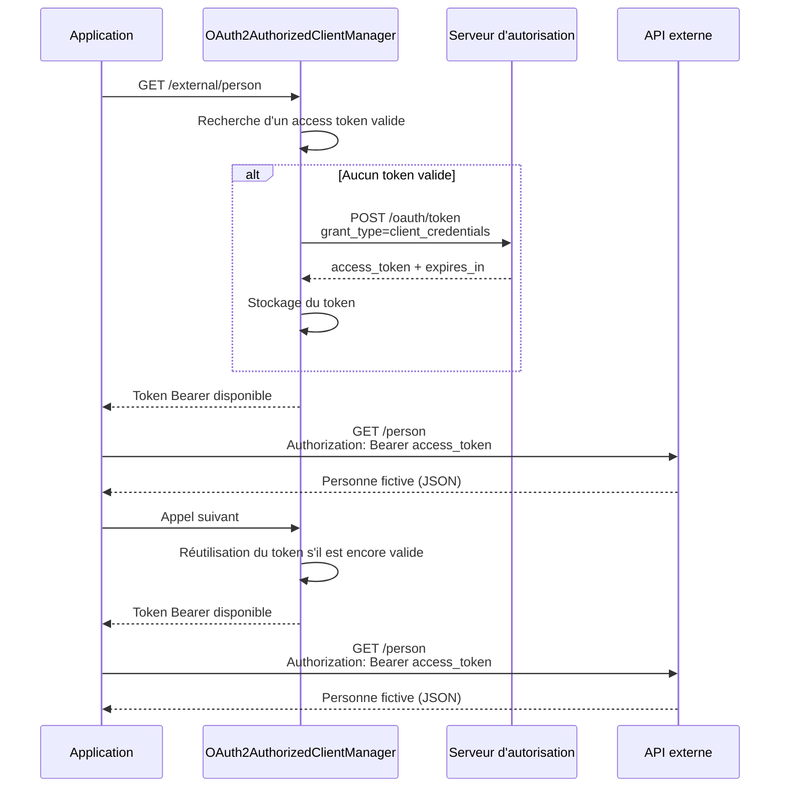
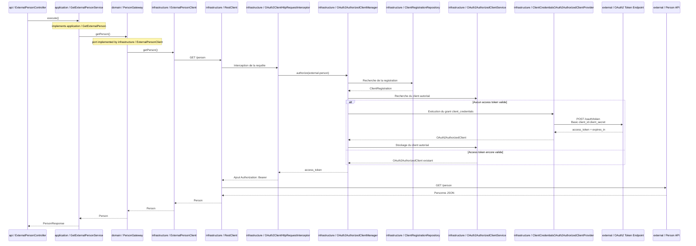

# Spring API OAuth client

## Référence OAuth2 : RFC 6749

Ce module met en œuvre le flux **Client Credentials Grant** décrit dans la
[RFC 6749 – The OAuth 2.0 Authorization Framework](https://www.rfc-editor.org/rfc/rfc6749.html),
notamment sa section [4.4](https://www.rfc-editor.org/rfc/rfc6749.html#section-4.4).

Ce flux est destiné aux échanges de machine à machine : l'application agit en son propre nom
et obtient un access token auprès du serveur d'autorisation en s'authentifiant avec son
`client_id` et son `client_secret`. Aucun utilisateur n'intervient dans le flux.

Dans cette maquette, l'authentification du client auprès du token endpoint utilise la méthode
`client_secret_basic` : le `client_id` et le `client_secret` sont transmis dans l'en-tête HTTP
`Authorization` via le mécanisme Basic Auth, sur une connexion HTTPS en production. D'autres
modes d'authentification du client sont également possibles selon les capacités du serveur
d'autorisation, mais ils ne sont pas détaillés ici.

Spring Security masque cette mécanique au code métier. Lors du premier appel à l'API externe,
le token est récupéré puis ajouté dans l'en-tête `Authorization`. Tant qu'il reste valide,
le même token est réutilisé ; un nouveau token n'est demandé qu'à son expiration.



## Séquence technique

Le diagramme suivant reprend les classes réellement impliquées, avec leur couche, depuis
l'endpoint entrant jusqu'à l'API externe. `GetExternalPersonService` implémente le port
`application / GetExternalPerson` et `ExternalPersonClient` implémente le port
`domain / PersonGateway`.



API maquette en Java avec Spring Boot 4.0.4 et quatre couches :

- `api` : exposition HTTP (`GET /external/person`)
- `application` : cas d'utilisation
- `domain` : modèle et port d'accès à la personne
- `infrastructure` : client HTTP `RestClient` et configuration OAuth2

## Objectif

L'endpoint `GET /external/person` appelle un service externe `GET /person`.
Le service externe exige un token OAuth2 obtenu avec le flux `client_credentials`.
Le token endpoint et le service externe sont simulés par WireMock dans les tests.

Le code utilise `RestClient` et Spring Security OAuth2 Client afin que l'obtention,
le passage et la réutilisation du token soient transparents pour le client métier.

## Fonctionnement de `spring-security-oauth2-client`

La configuration se trouve dans
`src/main/java/com/example/demo/infrastructure/OAuth2ClientConfiguration.java`.
Elle assemble plusieurs composants, chacun ayant une responsabilité distincte.

### `ClientRegistration`

`ClientRegistration` décrit le client OAuth2 et le serveur d'autorisation :

- l'URL du token endpoint ;
- le `client_id` et le `client_secret` ;
- la méthode d'authentification du client (`client_secret_basic`) ;
- le grant type (`client_credentials`) ;
- les scopes demandés.

Cette classe décrit la configuration du protocole, mais ne déclenche pas encore d'appel réseau.

### `ClientRegistrationRepository`

Le repository permet de retrouver une registration à partir de son identifiant :

```text
external-person -> ClientRegistration
```

L'intercepteur OAuth2 s'en sert pour savoir quelle configuration utiliser.

### `OAuth2AuthorizedClientService`

Ce service conserve les clients OAuth2 autorisés et leurs tokens. Il permet de réutiliser un
token tant qu'il est valide au lieu d'appeler le token endpoint à chaque requête.

La maquette utilise `InMemoryOAuth2AuthorizedClientService`. Le token est donc perdu au
redémarrage de l'application ; en production, un stockage persistant ou une stratégie adaptée
pourra être utilisé.

### `OAuth2AuthorizedClientManager`

Le manager orchestre le cycle de vie du token :

1. retrouver la registration ;
2. chercher un token déjà enregistré ;
3. vérifier sa validité ;
4. obtenir un nouveau token si nécessaire ;
5. enregistrer puis retourner le token.

### `OAuth2AuthorizedClientProvider`

Le provider indique au manager quels flux OAuth2 il sait exécuter :

```java
manager.setAuthorizedClientProvider(
        OAuth2AuthorizedClientProviderBuilder.builder()
                .clientCredentials()
                .build());
```

Ici, seul le flux `client_credentials` est activé.

### Pourquoi `client_credentials` apparaît deux fois ?

La registration contient :

```java
.authorizationGrantType(AuthorizationGrantType.CLIENT_CREDENTIALS)
```

Cela décrit le protocole déclaré par le client.

Le manager contient :

```java
.clientCredentials()
```

Cela active le composant capable d'exécuter ce protocole.

La première occurrence décrit la configuration ; la seconde configure le comportement du manager.
Cette séparation permet notamment de combiner plusieurs providers, par exemple
`clientCredentials()` et `refreshToken()`.

### `OAuth2ClientHttpRequestInterceptor`

L'intercepteur connecte le manager au `RestClient` :

```java
RestClient.builder()
        .baseUrl(baseUrl)
        .requestInterceptor(oauth2Interceptor)
        .build();
```

Pour chaque requête sortante, il récupère un token valide auprès du manager et ajoute
automatiquement l'en-tête :

```http
Authorization: Bearer <access_token>
```

Le client métier peut donc rester simple :

```java
restClient.get()
        .uri("/person")
        .retrieve()
        .body(Person.class);
```

Comme l'application n'utilise qu'une registration fixe, le resolver de l'intercepteur retourne
directement `external-person`. Il n'est donc pas nécessaire d'ajouter un attribut
`clientRegistrationId` sur chaque requête.

Le déroulement complet est donc :

```text
ClientRegistration
        -> ClientRegistrationRepository
        -> OAuth2AuthorizedClientManager
        -> OAuth2AuthorizedClientProvider
        -> OAuth2AuthorizedClientService
        -> OAuth2ClientHttpRequestInterceptor
        -> RestClient avec Bearer token
```

## Configuration dans `application.yml`

Dans cette maquette, le module direct `spring-security-oauth2-client` est utilisé et la
registration est construite dans le code d'infrastructure. L'URI du token endpoint est
toutefois fournie séparément par `external-person.token-uri`, afin de dissocier l'URL du
service métier de celle du serveur d'autorisation.

Une alternative plus conventionnelle consiste à utiliser :

```xml
<dependency>
    <groupId>org.springframework.boot</groupId>
    <artifactId>spring-boot-starter-oauth2-client</artifactId>
</dependency>
```

Avec ce starter, Spring Boot peut créer automatiquement les registrations et le service de
clients autorisés à partir de `application.yml` :

```yaml
spring:
  security:
    oauth2:
      client:
        registration:
          external-person:
            provider: external-person
            client-id: mock-client
            client-secret: mock-secret
            client-authentication-method: client_secret_basic
            authorization-grant-type: client_credentials
            scope: person.read
        provider:
          external-person:
            token-uri: http://localhost:9561/oauth/token
```

Cette variante réduit le code de configuration Java, mais active davantage d'auto-configuration
Spring Boot et rend les paramètres OAuth2 visibles dans la configuration applicative. Les secrets
ne doivent pas être stockés en clair dans un fichier de configuration versionné ; utiliser un
secret manager ou des variables d'environnement en production.

## Lancer

```shell
mvn spring-boot:run
```

L'API appelle `GET ${external-person.base-url}/person`. Le token est obtenu automatiquement sur
`http://localhost:9561/oauth/token` avec le flux OAuth2 `client_credentials`.
L'URL du service de personnes et l'URL du token endpoint sont donc indépendantes.
La configuration OAuth2 du client est déclarée dans `infrastructure/OAuth2ClientConfiguration.java`.
Les URLs du service externe et du token endpoint sont configurées séparément avec
`external-person.base-url` et `external-person.token-uri`.

Les valeurs par défaut pointent vers `http://localhost:9561`, port utilisé par les tests WireMock.
En production, externaliser les constantes OAuth2 de l'infrastructure, par exemple via un secret manager.

## WireMock en local

Les mappings du mock sont partagés entre les tests et un lancement standalone :

```text
wiremock/
└── mappings/
    ├── oauth-token.json
    └── person.json
```

Lancer WireMock séparément avec le même dossier :

```shell
java -jar wiremock-standalone.jar --port 9561 --root-dir wiremock
```

Puis lancer l'API :

```shell
mvn spring-boot:run
```

Appeler directement l'API : [http://localhost:8080/external/person](http://localhost:8080/external/person)

## Vérifier

```shell
mvn test
```
