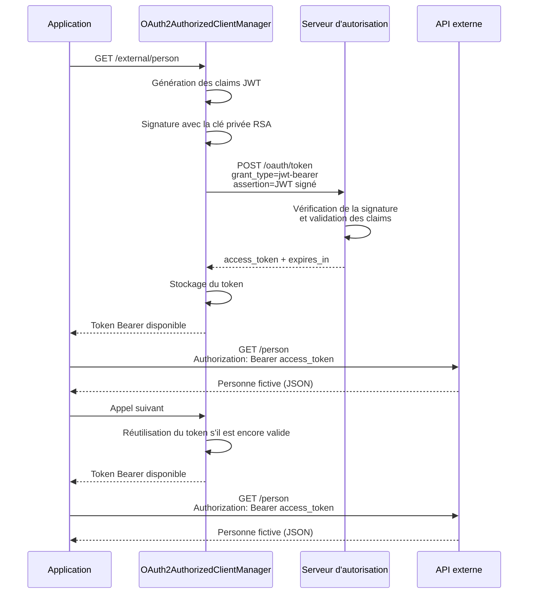
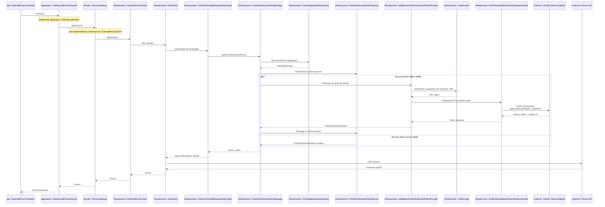

# API OAuth2 JWT Bearer

Module Spring Boot 4.0.4 reprenant l'API maquette en quatre couches et utilisant
le grant OAuth2 JWT Bearer défini par la [RFC 7523 section 2.1](https://www.rfc-editor.org/rfc/rfc7523.html#section-2.1).

## Références OAuth2

Ce module s'appuie sur deux RFC complémentaires :

- [RFC 7521 – Assertion Framework for OAuth 2.0 Client Authentication and Authorization Grants](https://www.rfc-editor.org/rfc/rfc7521.html)
- [RFC 7523 – JSON Web Token (JWT) Profile for OAuth 2.0 Client Authentication and Authorization Grants](https://www.rfc-editor.org/rfc/rfc7523.html)

La RFC 7521 définit le cadre général des **assertions** dans OAuth2. Une assertion est un
ensemble d'informations de sécurité, généralement signé, présenté au serveur d'autorisation.
Elle peut être utilisée comme authorization grant ou comme mécanisme d'authentification du
client.

La RFC 7523 précise comment utiliser un JWT comme assertion dans ce cadre. Dans ce module, le
JWT est utilisé comme **authorization grant** : il est présenté au token endpoint pour obtenir
un access token. Le JWT n'est donc pas le token utilisé ensuite pour appeler l'API métier.

## Flux

Pour appeler `GET /person`, le client demande d'abord un access token à
`external-person.token-uri` avec une requête de formulaire contenant :

```text
grant_type=urn:ietf:params:oauth:grant-type:jwt-bearer
assertion=<JWT signé>
scope=person.read
```

Aucune authentification Basic n'est utilisée auprès du token endpoint : ni `client_id` ni
`client_secret` ne sont envoyés dans le formulaire. Le `CLIENT_ID` reste toutefois présent
dans les claims `iss` et `sub` du JWT afin d'identifier l'émetteur et le sujet de l'assertion.

Le JWT contient également une audience correspondant au token endpoint, des dates d'émission et
d'expiration ainsi qu'un identifiant unique `jti`. Il est signé avec la clé privée RSA du client.
Le serveur d'autorisation vérifie la signature avec la clé publique associée au client et valide
les claims avant de délivrer l'access token.



## Séquence technique

Le diagramme reprend les mêmes couches et le même parcours que le module
`api-oauth-client-cc`. La différence se situe dans la partie infrastructure : le provider JWT
génère une assertion signée avant de demander l'access token.



### Assertion JWT et authentification du client

La RFC 7521 permet également un autre scénario, non utilisé ici : conserver le grant
`client_credentials` et utiliser un JWT pour authentifier le client avec les paramètres
`client_assertion_type` et `client_assertion`.

Dans ce cas, la requête serait conceptuellement :

```text
grant_type=client_credentials
client_assertion_type=urn:ietf:params:oauth:client-assertion-type:jwt-bearer
client_assertion=<JWT signé>
scope=person.read
```

La différence est la suivante :

| Scénario | `grant_type` | Rôle du JWT |
| --- | --- | --- |
| Module actuel | `urn:ietf:params:oauth:grant-type:jwt-bearer` | Le JWT est l'authorization grant |
| Authentification par JWT | `client_credentials` | Le JWT authentifie le client |

Ces deux mécanismes peuvent être utilisés séparément ou combinés selon la politique du serveur
d'autorisation.

Le JWT est signé avec une paire RSA codée dans
`src/main/java/com/example/demo/infrastructure/OAuth2ClientConfiguration.java`.
Cette paire est uniquement destinée à la maquette et ne doit jamais être utilisée en production.

Spring Security fournit `JwtBearerOAuth2AuthorizedClientProvider`, qui obtient le token à partir
du JWT généré par le resolver. `OAuth2ClientHttpRequestInterceptor` ajoute ensuite automatiquement
le token d'accès dans l'en-tête Bearer de l'appel `RestClient` vers `/person`.

## WireMock

Les mappings partagés avec le lancement standalone sont dans :

```text
wiremock/
└── mappings/
    ├── oauth-token.json
    └── person.json
```

Lancer WireMock sur le port attendu :

```shell
java -jar wiremock-standalone.jar --port 9561 --root-dir wiremock --verbose
```

Puis lancer l'application depuis ce module :

```shell
mvn spring-boot:run
```

Tester l'API :

```shell
curl http://localhost:8080/external/person
```

Appeler directement l'API : [http://localhost:8080/external/person](http://localhost:8080/external/person)

## Vérifier

Arrêter tout WireMock standalone utilisant le port `9561`, puis exécuter depuis la racine Maven :

```shell
mvn test -pl api-oauth-client-jwt -am
```
